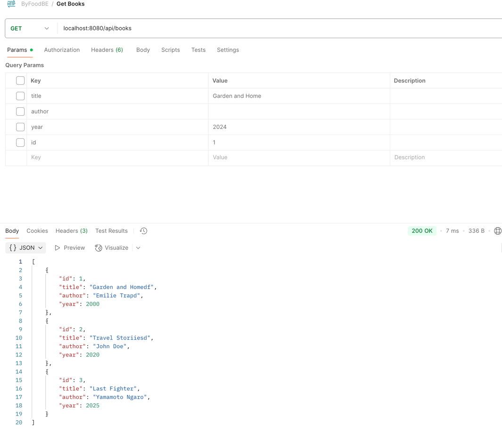
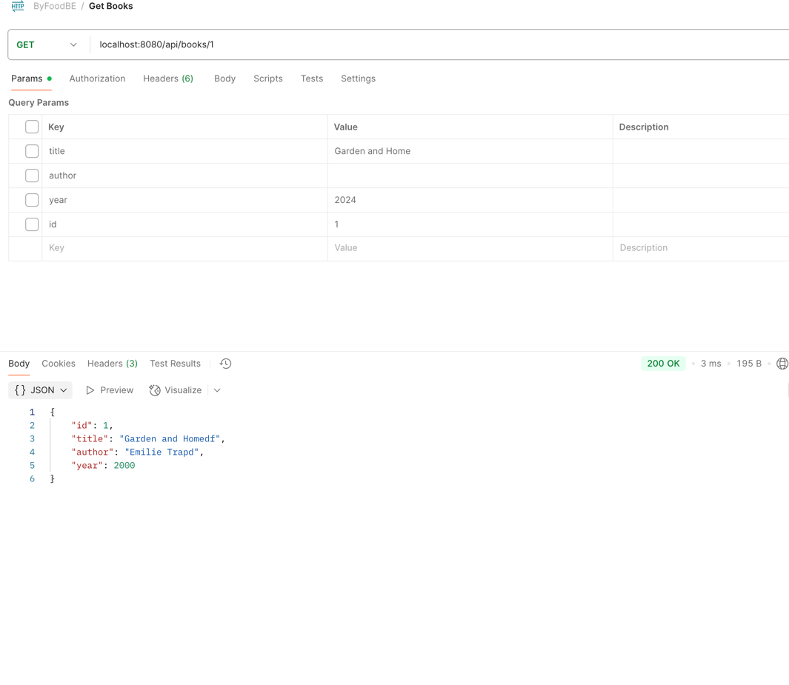
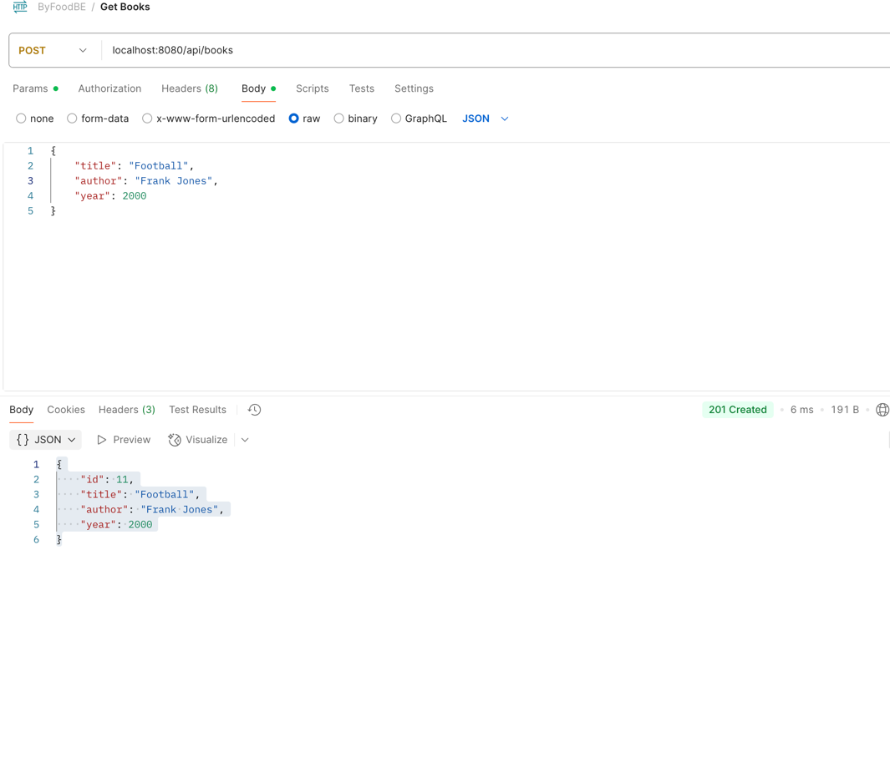
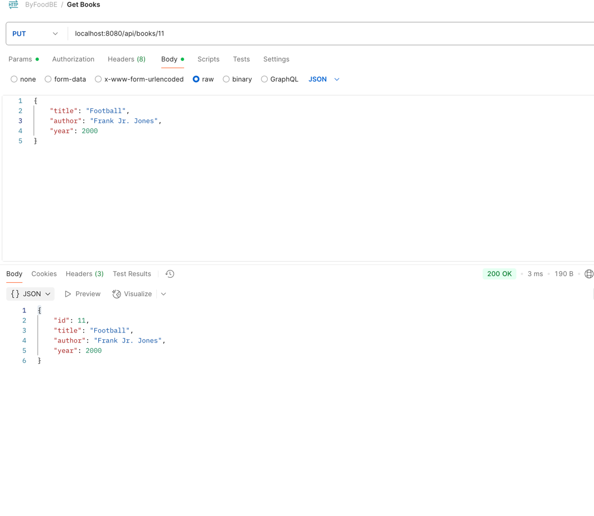
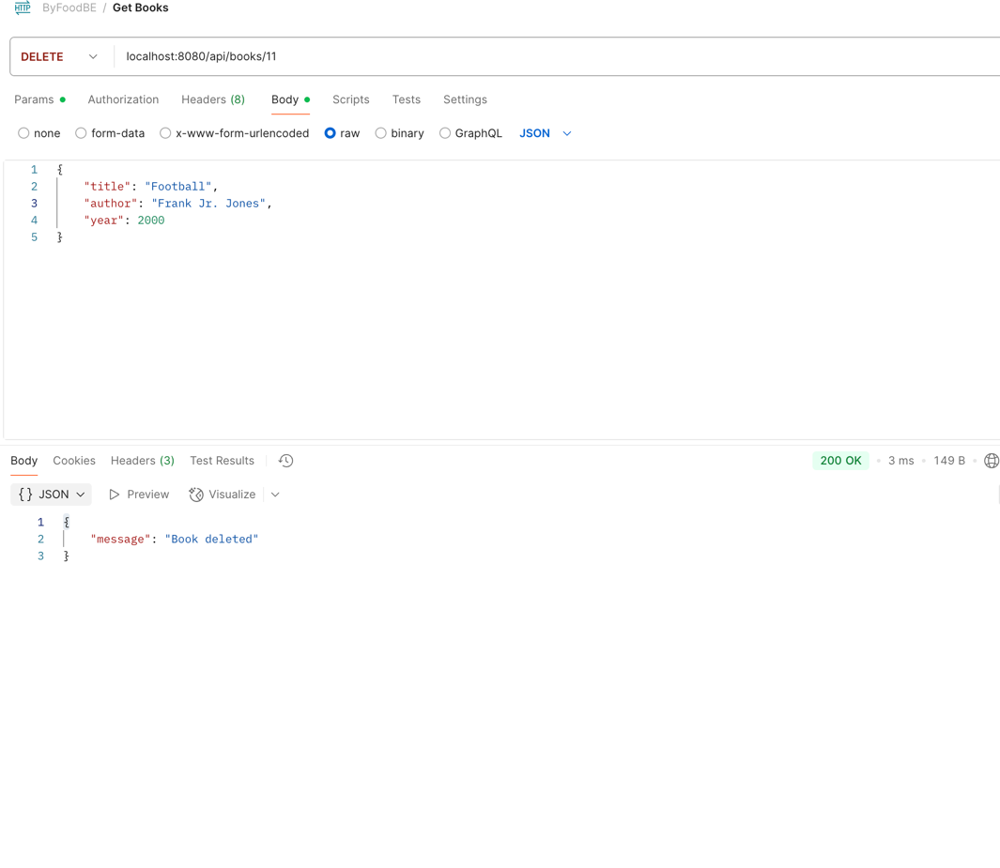
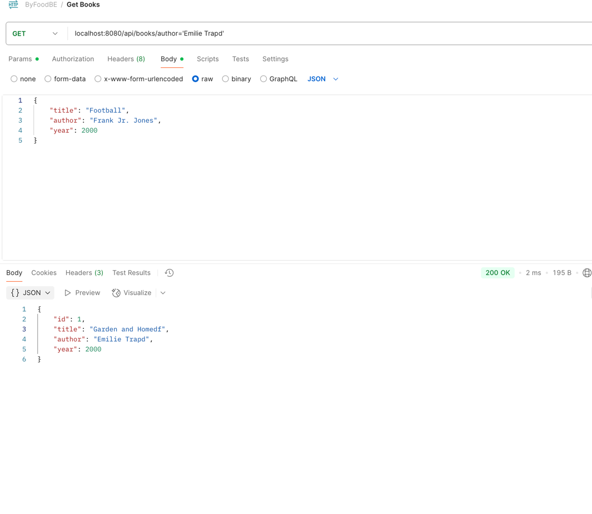

# byfood

A Go REST API for managing books, using Gin, GORM, and SQLite. Includes Swagger docs, SonarQube integration, and CI with GitHub Actions.

## Requirements
- Go 1.21+
- [Git](https://git-scm.com/)
- [SQLite](https://www.sqlite.org/) (optional, for inspecting the DB)

## Dependency Installation
Clone the repository and install Go dependencies:

```sh
git clone https://github.com/burhangltekin/byfood.git
cd byfood
go mod download
```

## SQLite DB Initialization
The database is automatically created and migrated on app start. To inspect or manually create the DB:

```sh
# Install SQLite if not present
brew install sqlite3  # macOS
sudo apt-get install sqlite3  # Ubuntu/Debian

# Create an empty DB (optional, app will do this)
sqlite3 books.db

# (Optional) Inspect tables
sqlite3 books.db ".tables"
SQLite can be opened via Applications on Desktop
```

## Running the App

```sh
go run main.go
```

The API will be available at `http://localhost:8080` by default.

## Running the Tests

```sh
go test ./...
```

## Code Coverage
To generate a coverage report:
```sh
go test -coverprofile=coverage.out ./...
```

## Swagger API Documentation
The OpenAPI (Swagger) docs are generated in the `swagger/` directory as `docs.json`.

To view the docs:
1. Go to [Swagger Editor](https://editor.swagger.io/)
2. Click **File > Import File** and select `swagger/docs.json` from this repo

Or, you can use [Swagger UI](https://swagger.io/tools/swagger-ui/) locally:
- Download or clone Swagger UI
- Copy `swagger/docs.json` into the Swagger UI directory and set it as the default file

> **Note:** You do not need to install Swagger to use the API, but you can use Swagger Editor/UI to view and interact with the API documentation.

- To generate Swagger documentation,
- after adding swag comments to your controllers, run:
- 
  **swag init --output swagger --outputTypes json --parseDependency --parseInternal --generatedTime false && mv swagger/swagger.json swagger/doc.json**.
- After building the project, swagger UI can be accessed at `http://localhost:8080/swagger/index.html`.


## SonarQube Integration
- Code is analyzed on every push/PR to `main` via GitHub Actions.
- Coverage is uploaded to SonarCloud (see `.github/workflows/sonarqube.yml`).
- Configure your `SONAR_TOKEN` and `SONAR_HOST_URL` (and `SONAR_ORGANIZATION` if using SonarCloud) as GitHub repository secrets.

## Linting

This project uses [golangci-lint](https://golangci-lint.run/) for linting.

To install and run the linter:

```sh
go install github.com/golangci/golangci-lint/cmd/golangci-lint@latest
golangci-lint run ./...
```

You can also add this to your CI pipeline to enforce code quality.

## Project Structure

- `main.go` – Application entry point, server setup, and middleware.
- `config.yaml` – Configuration file for the app.
- `books.db` – SQLite database file (auto-created).
- `controllers/` – Handlers for API endpoints (e.g., book_controller.go).
- `models/` – Data models (e.g., book.go).
- `routes/` – Route definitions and grouping (e.g., router.go).
- `swagger/` – Swagger/OpenAPI documentation files.
- `utils/` – Utility functions (e.g., database connection).

## API Endpoints

All endpoints are prefixed with `/api`.

| Method | Endpoint         | Description           |
|--------|------------------|----------------------|
| GET    | /api/books       | List all books       |
| GET    | /api/books/:id   | Get a book by ID     |
| POST   | /api/books       | Create a new book    |
| PUT    | /api/books/:id   | Update a book by ID  |
| DELETE | /api/books/:id   | Delete a book by ID  |

### Example Usage

- List books: `curl http://localhost:8080/api/books`
- Get book: `curl http://localhost:8080/api/books/1`
- Create book: `curl -X POST -H "Content-Type: application/json" -d '{"title":"Book Title","author":"Author", "year": 2024}' http://localhost:8080/api/books`
- Update book: `curl -X PUT -H "Content-Type: application/json" -d '{"title":"Newer Title","author":"New Author", "year": 2024}' http://localhost:8080/api/books/1`
- Delete book: `curl -X DELETE http://localhost:8080/api/books/1`

## GitHub Repository
[https://github.com/burhangltekin/byfood](https://github.com/burhangltekin/byfood)

---

**Happy coding!**

Screenshots of the API in action:







